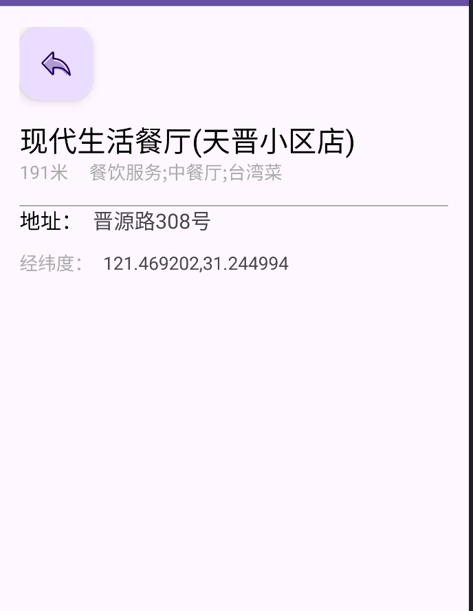

# Android-AMap-POI
基于高德地图SDK实现的Android POI搜索项目，支持定位、周边POI搜索、POI详情页、地图Marker标记、离线缓存等核心功能。

## 一、功能说明
### 核心功能
1. **定位功能**：获取当前设备经纬度，地图显示蓝点并自动定位到当前位置；
2. **POI搜索**：根据关键词搜索周边POI（如餐厅、超市），支持高德Web API请求；
3. **POI详情页**：点击列表项查看POI名称、地址、距离等信息；
4. **地图Marker**：点击列表项在地图添加Marker，显示InfoWindow（POI名称）；
5. **离线缓存**：搜索结果缓存到SharedPreferences，无网络时读取缓存数据；
6. **异常处理**：关键逻辑加异常捕获，避免APP崩溃。

### 技术栈
- 基础：Kotlin、Android SDK（minSdk 24+）；
- 地图：高德地图Android SDK（定位+地图+Web API）；
- 网络：Retrofit2 + Gson（解析POI接口数据）；
- 存储：SharedPreferences（离线缓存）；
- UI：ConstraintLayout、ScrollView、RecyclerView、FloatingActionButton；
- 权限：定位权限、网络权限申请。

## 二、项目截图
| 定位页面（自动定位+蓝点） | POI搜索列表（关键词搜索） | POI详情页（地址/距离展示） |
|--------------------------|--------------------------|--------------------------|
|  |  |  |

### 截图说明
- 定位页面：自动获取当前位置，地图聚焦到定位点并显示蓝点；
- 搜索列表：输入关键词后展示周边POI，包含名称/距离/地址；
- 详情页：点击列表项后展示POI完整信息，支持返回功能。

## 三、问题解决记录（核心踩坑点）
### 1. 高德Key无效导致搜索失败
- **现象**：POI搜索返回 `INVALID_USER_KEY` 错误；
- **原因**：Key与包名/SHA1不匹配，或未勾选Web API权限；
- **解决**：
  1. 高德开放平台确认包名（`com.example.map`）和SHA1（debug版）正确；
  2. 重新生成Key并替换到代码中；
  3. 确保勾选「Web服务API」权限。

### 2. 点击POI列表项APP直接退出
- **现象**：点击列表项后APP闪退，无明显提示；
- **原因**：
  - PoiDetailActivity未在Manifest注册；
  - 经纬度解析时格式错误/空值导致NumberFormatException；
  - 地图对象aMap为空触发NullPointerException；
- **解决**：
  1. 注册DetailActivity到AndroidManifest.xml；
  2. 对`poi.location`做空值+格式校验，解析时加异常捕获；
  3. 延迟初始化aMap，使用前校验非空。

### 3. Marker不显示/地图不移动
- **现象**：添加Marker后地图无变化，Marker不显示；
- **原因**：
  - aMap对象未初始化完成；
  - 经纬度顺序错误（高德是「经度,纬度」，LatLng是「纬度,经度」）；
- **解决**：
  1. 延迟500ms获取aMap对象；
  2. 确保LatLng参数是 `LatLng(lat, lng)`（纬度在前）。

### 4. 网络失败/无网时无提示
- **现象**：无网络时点击搜索无反应；
- **原因**：未判断网络状态，未处理Retrofit onFailure回调；
- **解决**：
  1. 封装NetworkUtil判断网络状态；
  2. 无网时读取SP缓存，无缓存则弹提示；
  3. onFailure回调添加Toast提示+日志打印。

### 5. 定位权限申请后仍无法定位
- **现象**：授予权限后定位返回无效经纬度（0.0, 0.0）；
- **原因**：
  - 高德定位客户端未正确初始化/销毁；
  - 模拟器未设置模拟位置；
- **解决**：
  1. 确保AmapLocationManager生命周期与Activity绑定；
  2. 真机测试，或模拟器设置模拟经纬度。

### 6. 缓存读取失败
- **现象**：无网时提示「无缓存数据」，但之前搜索过；
- **原因**：
  - 缓存Key不匹配（关键词/经纬度不一致）；
  - 缓存过期时间设置过短；
- **解决**：
  1. 缓存/读取时确保关键词、lat、lng完全匹配；
  2. 调整缓存过期时间（如30分钟），过期后清空缓存。

## 四、使用说明
1. 替换代码中的高德Key（`MapActivity`中`AMAP_KEY`常量）；
2. 确保手机/模拟器授予「定位权限」+「网络权限」；
3. 有网状态下输入关键词搜索，结果自动缓存；
4. 无网状态下搜索相同关键词，自动读取本地缓存；
5. 点击列表项：地图添加Marker+自动聚焦，同时跳转详情页。

